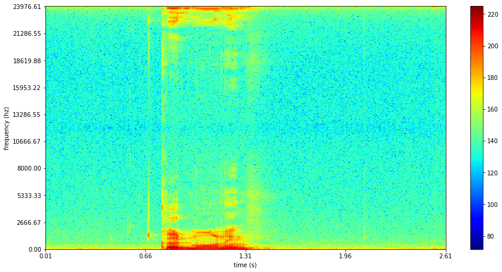
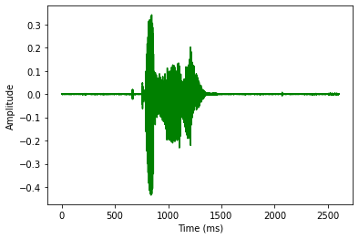
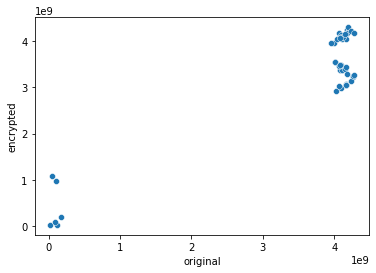
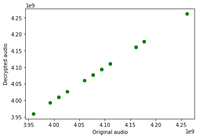

# AUDIO ENCRYPTION AND DECRYPTION USING CHAOTIC MAP

#### DONE BY

##### Sambit Sanyal & Vishakha Bhat


## For best results run this on Google Colab


```python
print("Setting Parameters")
inputfilename='good-morning.wav'


path="/content/"+inputfilename #Path to the audio file
big_num=20000                  #Number of keys generated, The bigger the number the bigger the chaos but at the same time the longer the key generation


print("Parameters set")
```

    Setting Parameters
    Parameters set
    


```python
from IPython.display import clear_output
print("This is a git repo to play audio files in Google colab\n Don't run the below block until this is done\n\n")
!git clone https://github.com/AllenDowney/ThinkDSP.git 
clear_output(wait=True)
print("Done!\nNow you can play audios in Google Colab")
```

    Done!
    Now you can play audios in Google Colab
    

### STEP 1 : Importing of libraries


```python
print("Importing Libraries")

# To chain the final binary keys
import itertools

#To read and write to audio(.wav) files:
import wave

# For Spectogram generation
import numpy as np
from matplotlib import pyplot as plt
import scipy.io.wavfile as wav
from numpy.lib import stride_tricks

#To clear unnecessary output 
from IPython.display import clear_output

#To get spectogram wave form generation 
import numpy
import matplotlib.pyplot as plt
import pylab
from scipy.io import wavfile
from scipy.fftpack import fft

# To play audio files in google colab
import sys
sys.path.insert(0, 'ThinkDSP/code/') 
import thinkdsp
import matplotlib.pyplot as pyplot
import IPython

def printlst (lst) :
  print('[',lst[0],lst[1],lst[2],lst[3],lst[4],lst[5],'......',len(lst),"items ]")

#For Cross-Correlation

import pandas as pd
import seaborn as sns


print("All libraries imported!")
```

    Importing Libraries
    All libraries imported!
    

### STEP 2 : Key generation using chaotic map


```python
print("Key generation starts")


def keygen(x,r,size):
  key=[]
  for i in range(size):
    x=r*x*(1-x)
    key.append(((x*pow(10,16))%256.126))
  return key
print("Key generated:")
printlst(keygen(0.0123,3.9159,big_num)) #values could be changed accordingly
```

    Key generation starts
    Key generated:
    [ 245.7084219499086 173.52781167185526 106.22965462235584 135.55734787549773 129.83433193306382 241.83943323140556 ...... 20000 items ]
    


```python
#<----RUN ONLY ONCE PER SESSION! DO NOT KEEP RE-RUNNING


print("Generating Deck keys using chaotic map")
deckey=[]
for i in range(big_num):
  deckey.append(keygen(0.0123,3.9159,big_num)[i] -int(keygen(0.0123,3.9159,big_num)[i]))
  print(i+1, "keys generated")
#print(deckey)
clear_output(wait=True)
print(i+1, "keys generated")
print("Deck keys generated using chaotic map")
printlst(deckey)
```

    20000 keys generated
    Deck keys generated using chaotic map
    [ 0.7084219499085975 0.527811671855261 0.229654622355838 0.5573478754977259 0.8343319330638224 0.8394332314055646 ...... 20000 items ]
    


```python
print("Generating final keys from deck key")
finkey=[]
for i in range(big_num):
  finkey.append(int(str(deckey[i])[-3:]))
#finkey.append(int(str(deckey[-3:])))
print("Final key generted:")
printlst(finkey)
```

    Generating final keys from deck key
    Final key generted:
    [ 975 261 838 259 224 646 ...... 20000 items ]
    


```python
print("Generating binary keys from final keys")
binkey=[]
for i in range(big_num):
  binkey.append(bin(finkey[i]))
print("Binary key generated:")
printlst(binkey)
```

    Generating binary keys from final keys
    Binary key generated:
    [ 0b1111001111 0b100000101 0b1101000110 0b100000011 0b11100000 0b1010000110 ...... 20000 items ]
    


```python
print("Splitting binary keys on the \'b\' ")
binkey_fin=[]
import re
for i in range(big_num):
  binkey_fin.append(re.findall(r'\d+', binkey[i]))
print("Now we have a list of lists:")
printlst(binkey_fin)
```

    Splitting binary keys on the 'b' 
    Now we have a list of lists:
    [ ['0', '1111001111'] ['0', '100000101'] ['0', '1101000110'] ['0', '100000011'] ['0', '11100000'] ['0', '1010000110'] ...... 20000 items ]
    


```python
#import itertools
print("Converting list of lists into one list")
merged = list(itertools.chain(*binkey_fin))
print('The merged list is:')
printlst(merged)
```

    Converting list of lists into one list
    The merged list is:
    [ 0 1111001111 0 100000101 0 1101000110 ...... 40000 items ]
    


```python
print("Deleting the alternate zero values")
del merged[0::2]
print("After removing non zero values we have")
printlst(merged)
```

    Deleting the alternate zero values
    After removing non zero values we have
    [ 1111001111 100000101 1101000110 100000011 11100000 1010000110 ...... 20000 items ]
    


```python
print("Converting string to integer:")

mergedfinal = list(map(int, merged))
printlst(mergedfinal)
```

    Converting string to integer:
    [ 1111001111 100000101 1101000110 100000011 11100000 1010000110 ...... 20000 items ]
    

### STEP 3 : Extracting Data from Input Audio File


```python
print("Extract from input audio file")
print(path)
#import wave

w = wave.open(path, 'r')

channels=w.getnchannels()
print("Number of channels",channels)


framerate=w.getframerate()
print("FrameRate:",framerate)


sampwidth=w.getsampwidth()
print("Sample Width:",sampwidth)


framerate=w.getframerate()
print("FrameRate:",framerate)


print("\nNumber of Frames: ", w.getnframes())
frameslst=[]
for i in range(w.getnframes()):
  frame=w.readframes(1)
  frameslst.append(frame)
  #print(frame)

print("The frames are")
printlst(frameslst)

```

    Extract from input audio file
    /content/good-morning.wav
    Number of channels 2
    FrameRate: 48000
    Sample Width: 2
    FrameRate: 48000
    
    Number of Frames:  124992
    The frames are
    [ b'\xfd\xff\xfb\xff' b'\xf8\xff\xf8\xff' b'\xf7\xff\xf3\xff' b'\xf8\xff\xf6\xff' b'\xf7\xff\xf5\xff' b'\xf4\xff\xf3\xff' ...... 124992 items ]
    


```python
print("\nNow converting them into integers\n")
intframe=[]
for frame in frameslst :
  int_val = int.from_bytes(frame, "big")
  intframe.append(int_val)
  #print(int_val)

print("The integer frames are:\n")
printlst(intframe)
```

    
    Now converting them into integers
    
    The integer frames are:
    
    [ 4261411839 4177524991 4160746495 4177524479 4160747007 4110414847 ...... 124992 items ]
    


```python
keysize = len(mergedfinal)
print("The number of key values we have generated :",keysize)

print("The number of byte frames we have :",len(intframe))


```

    The number of key values we have generated : 20000
    The number of byte frames we have : 124992
    

### STEP 4 : XOR Encryption


```python
print("XOR - ENCRYPTION") 

xor_result=[]

for i in range(len(intframe)):
  xor=intframe[i]^mergedfinal[i%keysize] # m mod n returns a value only from 0 to n , no matter how large m is 
  xor_result.append(xor)

print("The XOR result is:")
printlst(xor_result)


```

    XOR - ENCRYPTION
    The XOR result is:
    [ 3217519592 4245297562 3059752529 4245297140 4149652127 3368850193 ...... 124992 items ]
    


```python
#Convert XOR Result to bytearray

check=[]
print("Now converting XOR values into frames:")
for num in xor_result:
  bytes_val = num.to_bytes(4, 'big')
  #print(bytes_val)
  check.append(bytes_val)
check.reverse()
print("\nBytes list\n")
printlst(check)
```

    Now converting XOR values into frames:
    
    Bytes list
    
    [ b'\x04B\xf0\xb8' b'9\x9f\x06\xb7' b'=\xa9\x1d\xc4' b'9\x0f\x7fJ' b'8\x01\x8b\xa2' b'9\x8f\xc1+' ...... 124992 items ]
    

### STEP 5: Writing to an Encrypted Audio File


```python
#code to convert bytearray to wav audio file

print("Now writing the encypted values to an audio file")
filename='encrypted-'+inputfilename

 
writer=wave.open('/content/'+filename,'wb')

writer.setnchannels(channels)
writer.setsampwidth(sampwidth)
writer.setframerate(framerate)
writer.setnframes(1)
for frame in check:
 writer.writeframesraw(frame)
writer.close()

print("Written to file ", filename)
```

    Now writing the encypted values to an audio file
    Written to file  encrypted-good-morning.wav
    


```python
print("Now we can analyse the encrypted file!")


### STEP 6 : Decryption and retrieval of audio file


```python
#DECRYPTION
print("Now we shall decrypt the encrypted values using XOR")
orig=[]
#print("The integer frames are:")
#print(intframe)

for i in range(len(xor_result)):
  xor=xor_result[i]^mergedfinal[i%keysize]
  orig.append(xor)

print("The decrypted result is:")
#xor_result.reverse()
printlst(orig)


#printlst(intframe)
```

    Now we shall decrypt the encrypted values using XOR
    The decrypted result is:
    [ 4261411839 4177524991 4160746495 4177524479 4160747007 4110414847 ...... 124992 items ]
    


```python
#Convert Decrypted result to bytearray

checked=[]
print("Now converting them back into frames:")
for num in orig:
  bytes_val = num.to_bytes(4, 'big')
  #print(bytes_val)
  checked.append(bytes_val)
#print("\nBytes list\n")
printlst(checked)
```

    Now converting them back into frames:
    [ b'\xfd\xff\xfb\xff' b'\xf8\xff\xf8\xff' b'\xf7\xff\xf3\xff' b'\xf8\xff\xf6\xff' b'\xf7\xff\xf5\xff' b'\xf4\xff\xf3\xff' ...... 124992 items ]
    


```python
#Write to an audio file
print("Now we write the values back into a audio file")

filename='decrypted-'+inputfilename
 
writer=wave.open('/content/'+filename,'wb')

writer.setnchannels(channels)
writer.setsampwidth(sampwidth)
writer.setframerate(framerate)
writer.setnframes(1)
for frame in checked:
 writer.writeframesraw(frame)
writer.close()

print("Written to file ", filename)
```

    Now we write the values back into a audio file
    Written to file  decrypted-good-morning.wav
    


### STEP 7 : Spectogram generation


```python
#spectogram getting code

#import numpy as np
#from matplotlib import pyplot as plt
#import scipy.io.wavfile as wav
#from numpy.lib import stride_tricks

print("Function to get spectogram : set")
""" short time fourier transform of audio signal """
def stft(sig, frameSize, overlapFac=0.5, window=np.hanning):
    win = window(frameSize)
    hopSize = int(frameSize - np.floor(overlapFac * frameSize))

    # zeros at beginning (thus center of 1st window should be for sample nr. 0)   
    samples = np.append(np.zeros(int(np.floor(frameSize/2.0))), sig)    
    # cols for windowing
    cols = np.ceil( (len(samples) - frameSize) / float(hopSize)) + 1
    # zeros at end (thus samples can be fully covered by frames)
    samples = np.append(samples, np.zeros(frameSize))

    frames = stride_tricks.as_strided(samples, shape=(int(cols), frameSize), strides=(samples.strides[0]*hopSize, samples.strides[0])).copy()
    frames *= win

    return np.fft.rfft(frames)    

""" scale frequency axis logarithmically """    
def logscale_spec(spec, sr=44100, factor=20.):
    timebins, freqbins = np.shape(spec)

    scale = np.linspace(0, 1, freqbins) ** factor
    scale *= (freqbins-1)/max(scale)
    scale = np.unique(np.round(scale))

    # create spectrogram with new freq bins
    newspec = np.complex128(np.zeros([timebins, len(scale)]))
    for i in range(0, len(scale)):        
        if i == len(scale)-1:
            newspec[:,i] = np.sum(spec[:,int(scale[i]):], axis=1)
        else:        
            newspec[:,i] = np.sum(spec[:,int(scale[i]):int(scale[i+1])], axis=1)

    # list center freq of bins
    allfreqs = np.abs(np.fft.fftfreq(freqbins*2, 1./sr)[:freqbins+1])
    freqs = []
    for i in range(0, len(scale)):
        if i == len(scale)-1:
            freqs += [np.mean(allfreqs[int(scale[i]):])]
        else:
            freqs += [np.mean(allfreqs[int(scale[i]):int(scale[i+1])])]

    return newspec, freqs

""" plot spectrogram"""
def spectogram(audiopath, binsize=2**10, plotpath=None, colormap="jet"): #<------THIS ONEEEEEEEEEE
    samplerate, samples = wav.read(audiopath)

    s = stft(samples, binsize)

    sshow, freq = logscale_spec(s, factor=1.0, sr=samplerate)

    ims = 20.*np.log10(np.abs(sshow)/10e-6) # amplitude to decibel

    timebins, freqbins = np.shape(ims)

    print("timebins: ", timebins)
    print("freqbins: ", freqbins)

    plt.figure(figsize=(15, 7.5))
    plt.imshow(np.transpose(ims), origin="lower", aspect="auto", cmap=colormap, interpolation="none")
    plt.colorbar()
    
    plt.xlabel("time (s)")
    plt.ylabel("frequency (hz)")
    plt.xlim([0, timebins-1])
    plt.ylim([0, freqbins])

    xlocs = np.float32(np.linspace(0, timebins-1, 5))
    plt.xticks(xlocs, ["%.02f" % l for l in ((xlocs*len(samples)/timebins)+(0.5*binsize))/samplerate])
    ylocs = np.int16(np.round(np.linspace(0, freqbins-1, 10)))
    plt.yticks(ylocs, ["%.02f" % freq[i] for i in ylocs])

    if plotpath:
        plt.savefig(plotpath, bbox_inches="tight")
    else:
        plt.show()

    plt.clf()

    return ims
```

    Function to get spectogram : set
    


```python
print("Calling spectogram function on original file")

ims = spectogram(path)
print(path)
```

    Calling spectogram function on original file
    timebins:  489
    freqbins:  513
    





    /content/good-morning.wav
    


    <Figure size 432x288 with 0 Axes>


```python
print("Calling spectogram function on encrypted file")
ims=spectogram('/content/'+'encrypted-'+inputfilename)
print('encrypted-'+inputfilename)
```

    Calling spectogram function on encrypted file
    timebins:  489
    freqbins:  513
    


    encrypted-good-morning.wav
    


    <Figure size 432x288 with 0 Axes>


```python
print("Calling spectogram function on decrypted file")
ims=spectogram('/content/'+'decrypted-'+inputfilename)
print('decrypted-'+inputfilename)
```

    Calling spectogram function on decrypted file
    timebins:  489
    freqbins:  513
    


    decrypted-good-morning.wav
    


    <Figure size 432x288 with 0 Axes>


### STEP 8: Plotting Amplitude wave form


```python
#To get Spectogram wave form

#import numpy
#import matplotlib.pyplot as plt
#import pylab
#from scipy.io import wavfile
#from scipy.fftpack import fft
print(inputfilename)
myAudio = path
samplingFreq, mySound = wavfile.read(myAudio)
mySoundDataType = mySound.dtype
mySound = mySound / (2.**15)
mySoundShape = mySound.shape
samplePoints = float(mySound.shape[0])
signalDuration =  mySound.shape[0] / samplingFreq
mySoundOneChannel = mySound[:,0]
timeArray = numpy.arange(0, samplePoints, 1)
timeArray = timeArray / samplingFreq
timeArray = timeArray * 1000
plt.plot(timeArray, mySoundOneChannel, color='b')
plt.xlabel('Time (ms)')
plt.ylabel('Amplitude')
plt.show()


print('\n\n\n'+'encrypted-'+inputfilename)
myAudio = '/content/'+'encrypted-'+inputfilename
samplingFreq, mySound = wavfile.read(myAudio)
mySoundDataType = mySound.dtype
mySound = mySound / (2.**15)
mySoundShape = mySound.shape
samplePoints = float(mySound.shape[0])
signalDuration =  mySound.shape[0] / samplingFreq
mySoundOneChannel = mySound[:,0]
timeArray = numpy.arange(0, samplePoints, 1)
timeArray = timeArray / samplingFreq
timeArray = timeArray * 1000
plt.plot(timeArray, mySoundOneChannel, color='r')
plt.xlabel('Time (ms)')
plt.ylabel('Amplitude')
plt.show()

print('\n\n\n'+'decrypted-'+inputfilename)
myAudio = '/content/'+'decrypted-'+inputfilename
samplingFreq, mySound = wavfile.read(myAudio)
mySoundDataType = mySound.dtype
mySound = mySound / (2.**15)
mySoundShape = mySound.shape
samplePoints = float(mySound.shape[0])
signalDuration =  mySound.shape[0] / samplingFreq
mySoundOneChannel = mySound[:,0]
timeArray = numpy.arange(0, samplePoints, 1)
timeArray = timeArray / samplingFreq
timeArray = timeArray * 1000
plt.plot(timeArray, mySoundOneChannel, color='g')
plt.xlabel('Time (ms)')
plt.ylabel('Amplitude')
plt.show()


```

    good-morning.wav
    


    
    
    
    encrypted-good-morning.wav
    


    
    
    
    decrypted-good-morning.wav
    





### STEP 9: Plotting Correlation graph 


```python
print("CORRELATION BETWEEN ORIGINAL AUDIO AND ENCRYPTED AUDIO")

df = pd.DataFrame(list(zip(intframe, xor_result)),columns =['original', 'encrypted'])
df 
```

    CORRELATION BETWEEN ORIGINAL AUDIO AND ENCRYPTED AUDIO
    


<div>
<style scoped>
    .dataframe tbody tr th:only-of-type {
        vertical-align: middle;
    }

    .dataframe tbody tr th {
        vertical-align: top;
    }

    .dataframe thead th {
        text-align: right;
    }
</style>
<table border="1" class="dataframe">
  <thead>
    <tr style="text-align: right;">
      <th></th>
      <th>original</th>
      <th>encrypted</th>
    </tr>
  </thead>
  <tbody>
    <tr>
      <th>0</th>
      <td>4261411839</td>
      <td>3217519592</td>
    </tr>
    <tr>
      <th>1</th>
      <td>4177524991</td>
      <td>4245297562</td>
    </tr>
    <tr>
      <th>2</th>
      <td>4160746495</td>
      <td>3059752529</td>
    </tr>
    <tr>
      <th>3</th>
      <td>4177524479</td>
      <td>4245297140</td>
    </tr>
    <tr>
      <th>4</th>
      <td>4160747007</td>
      <td>4149652127</td>
    </tr>
    <tr>
      <th>...</th>
      <td>...</td>
      <td>...</td>
    </tr>
    <tr>
      <th>124987</th>
      <td>939538944</td>
      <td>939625378</td>
    </tr>
    <tr>
      <th>124988</th>
      <td>956316928</td>
      <td>957316938</td>
    </tr>
    <tr>
      <th>124989</th>
      <td>1023427072</td>
      <td>1034493380</td>
    </tr>
    <tr>
      <th>124990</th>
      <td>1056981504</td>
      <td>966723255</td>
    </tr>
    <tr>
      <th>124991</th>
      <td>939539712</td>
      <td>71495864</td>
    </tr>
  </tbody>
</table>
<p>124992 rows × 2 columns</p>
</div>


```python
sns.scatterplot(data=df[:50], x="original", y="encrypted")
```


    <matplotlib.axes._subplots.AxesSubplot at 0x7f8a1cc1a890>





```python
plt.scatter( intframe[:20], xor_result[:20],color='r')

plt.xlabel("Original audio")   
plt.ylabel("Encrypted audio")
```


    Text(0, 0.5, 'Encrypted audio')


```python
dfdec = pd.DataFrame(list(zip(intframe, orig)),columns =['original', 'decrypted'])
dfdec
```


<div>
<style scoped>
    .dataframe tbody tr th:only-of-type {
        vertical-align: middle;
    }

    .dataframe tbody tr th {
        vertical-align: top;
    }

    .dataframe thead th {
        text-align: right;
    }
</style>
<table border="1" class="dataframe">
  <thead>
    <tr style="text-align: right;">
      <th></th>
      <th>original</th>
      <th>decrypted</th>
    </tr>
  </thead>
  <tbody>
    <tr>
      <th>0</th>
      <td>4261411839</td>
      <td>4261411839</td>
    </tr>
    <tr>
      <th>1</th>
      <td>4177524991</td>
      <td>4177524991</td>
    </tr>
    <tr>
      <th>2</th>
      <td>4160746495</td>
      <td>4160746495</td>
    </tr>
    <tr>
      <th>3</th>
      <td>4177524479</td>
      <td>4177524479</td>
    </tr>
    <tr>
      <th>4</th>
      <td>4160747007</td>
      <td>4160747007</td>
    </tr>
    <tr>
      <th>...</th>
      <td>...</td>
      <td>...</td>
    </tr>
    <tr>
      <th>124987</th>
      <td>939538944</td>
      <td>939538944</td>
    </tr>
    <tr>
      <th>124988</th>
      <td>956316928</td>
      <td>956316928</td>
    </tr>
    <tr>
      <th>124989</th>
      <td>1023427072</td>
      <td>1023427072</td>
    </tr>
    <tr>
      <th>124990</th>
      <td>1056981504</td>
      <td>1056981504</td>
    </tr>
    <tr>
      <th>124991</th>
      <td>939539712</td>
      <td>939539712</td>
    </tr>
  </tbody>
</table>
<p>124992 rows × 2 columns</p>
</div>


```python
sns.scatterplot(data=dfdec, x="original", y="decrypted")
```


    <matplotlib.axes._subplots.AxesSubplot at 0x7f8a1cba6e10>


```python
plt.scatter(intframe[:20], orig[:20] ,color='g')
plt.ylabel("Decrypted audio")
plt.xlabel("Original audio")
```


    Text(0.5, 0, 'Original audio')




